# 토마토미


**어린이 건강 습관 형성을 위한 로컬 LLM 기반 AI 코치 웹앱**  
**A Local LLM-Based AI Coaching Web App for Children's Healthy Habit Development**

## 1. 프로젝트 소개

토마토미는 어린이가 매일 건강 미션을 수행하며 생활 습관을 형성할 수 있도록 돕는 로컬 LLM 기반 AI 코치 웹앱입니다. 사용자는 미션 수행 결과나 변경 요청을 자연어로 입력하고, 챗봇 캐릭터 **토미**는 이를 해석해 격려, 건강 정보 제공, 미션 변경, 기록 조회 등의 기능을 수행합니다.

| 항목 | 내용 |
| --- | --- |
| 팀명 | 토마토미 |
| 작품명 | 어린이 건강 습관 형성을 위한 로컬 LLM 기반 AI 코치 웹앱 |
| 개발 기간 | 2026.03 ~ 2026.06 |

### 팀원 역할

| 이름 | 담당 업무 |
| --- | --- |
| 장수정 | DB 설계 및 구축, RAG 데이터 구축, 미션 추천·개인화 로직 구현, 성능 평가 |
| 이채원 | LLM 기반 AI 파이프라인 구축, Function Calling 및 대화 로직 설계, 데이터셋 구축 및 Fine-tuning, 프론트엔드 구현 |
| 한채원 | 백엔드 API 개발, 프론트엔드 구현, 채팅·미션 DB 연동, AI 로그 수집 구조 설계 |

## 주요 성과

| 지표 | 결과 |
| --- | --- |
| 실질 성공률 | 77.0% |
| DB 오기록 방지율 | 97.83% |
| RAG Faithfulness | 97.4% |
| Safe Response Rate | 100.0% |

## 시연 영상

🎥 (https://youtu.be/In-0NSLqvOY)


## 2. 프로젝트 배경

어린이는 성인에 비해 자기조절 능력이 충분히 발달하지 않았기 때문에 건강한 생활습관을 형성하기 위해 반복적인 피드백과 지속적인 참여 유도가 필요합니다. 하지만 기존 습관 관리 앱은 체크리스트나 알림 중심으로 구성되어 있어 사용자의 행동에 대해 상호작용하거나 개인화된 피드백을 제공하기 어렵습니다.

또한 어린이의 건강 정보와 활동 기록을 다루는 서비스인 만큼 개인정보 보호가 중요합니다. 토마토미는 외부 클라우드 AI API에 사용자 데이터를 전송하지 않고, 서버 내부에서 실행되는 로컬 LLM 기반 구조를 적용해 민감한 사용자 데이터가 외부로 전달되지 않도록 설계했습니다.

## 3. 주요 기능

- **AI 코치 채팅**: 사용자의 자연어 입력을 이해하고 챗봇 캐릭터 토미가 응답합니다.
- **미션 관리**: 오늘의 미션 조회, 수행 성공·실패 제출, 미션 변경, 제출 취소, 기록 조회를 지원합니다.
- **대체 수행 인정 판단**: "버피 대신 스쿼트로 해도 돼?"와 같은 발화를 분석해 기존 미션의 대체 수행 가능 여부를 판단합니다.
- **건강 노트**: 알레르기, 줄이고 싶은 음식, 사용자 상태 정보를 저장합니다.
- **건강 정보 제공**: RAG 기반 검색 결과를 바탕으로 어린이 눈높이에 맞는 건강 답변을 생성합니다.
- **맞춤 미션 생성**: 사용자 활동 기록, 선호 활동, 미션 변경 사유, 건강 노트를 바탕으로 개인화된 미션을 생성합니다.
- **보상 시스템**: 미션 성공, 퀴즈 완료, 출석 등을 하트, 경험치, 뽑기권과 연동합니다.
- **교육·퀴즈·게임·랭킹**: 건강 습관 형성을 위한 학습 콘텐츠와 지속 참여를 위한 UX 요소를 제공합니다.

## 4. 시스템 아키텍처

사용자 입력은 React 프론트엔드에서 FastAPI 백엔드의 `/chat` 또는 `/chat/stream` 엔드포인트로 전달됩니다. 백엔드는 입력의 서비스 범위와 안전성을 점검한 뒤 Intent Router를 통해 일반 대화, 미션 기능 요청, 건강 정보 질문, 추가 확인이 필요한 요청으로 분류합니다.

미션 관련 요청은 Fine-tuning된 Qwen3 0.6B Function Calling 모델을 통해 실행할 기능을 결정하고, 백엔드 검증 로직을 거쳐 DB 조회·저장·수정 작업으로 연결됩니다. 건강 정보 질문은 RAG 검색을 통해 관련 건강 문서와 FAQ를 찾고, 검색된 근거를 바탕으로 로컬 LLM이 답변을 생성합니다.

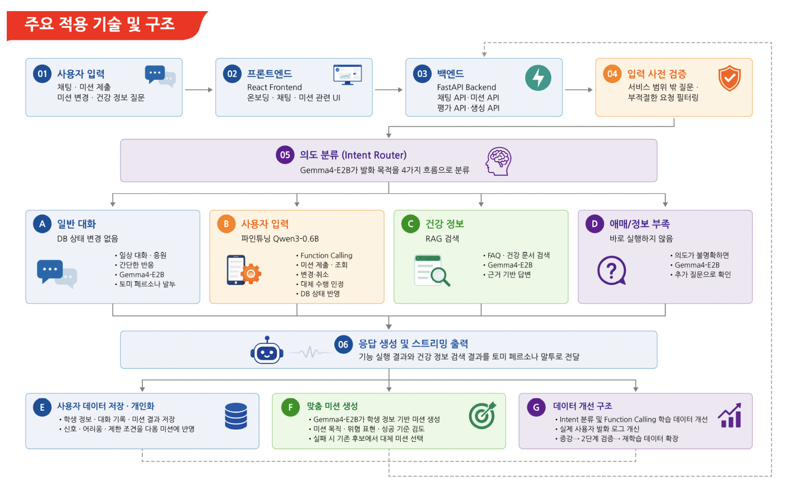

## 5. 기술 스택

| 구분 | 기술 |
| --- | --- |
| Frontend | React 18, Vite, Tailwind CSS, PostCSS |
| Backend | Python, FastAPI, Uvicorn, Pydantic |
| Database | PostgreSQL, Neon, psycopg2, SQLAlchemy, pgvector |
| AI / LLM | Ollama, Gemma 4 E2B, Fine-tuned Qwen3 0.6B |
| RAG | sentence-transformers, BAAI/bge-m3, pgvector |
| Evaluation | 회귀 테스트셋, RAG 평가셋, 스트리밍 응답 성능 측정 |

## 6. AI 파이프라인

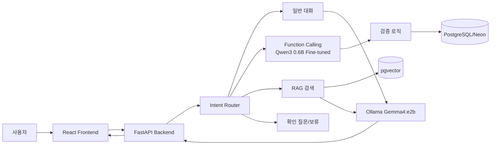

### Intent Routing

사용자 발화를 일반 대화, 미션 기능 요청, 건강 정보 질문, 추가 확인이 필요한 요청으로 분류합니다. 분류 결과에 따라 일반 응답, Function Calling, RAG, clarify/fallback 흐름으로 분기합니다.

### Function Calling

미션 관련 발화는 Fine-tuning된 Qwen3 0.6B Function Calling 모델을 통해 앱 기능 실행으로 연결됩니다.

| 함수 | 역할 |
| --- | --- |
| `submit_mission_result` | 미션 성공·실패 제출 |
| `get_mission_info` | 오늘 미션, 규칙, 마감 정보 조회 |
| `request_mission_adjustment` | 미션 변경, 난이도 조정 요청 |
| `check_mission_equivalency` | 대체 행동·장소·시간 인정 여부 판단 |
| `get_user_history` | 미션 수행 기록 조회 |
| `cancel_mission_action` | 제출 또는 변경 취소 |

LLM이 DB를 직접 수정하지 않고, 백엔드가 함수 호출 결과와 현재 DB 상태를 검증한 뒤 실제 기록 가능 여부를 판단합니다. 모호한 입력은 즉시 실행하지 않고 추가 확인 질문을 통해 DB 오기록을 방지합니다.

### RAG 기반 건강 정보 응답

건강 질문은 `BAAI/bge-m3` 임베딩 모델과 `pgvector` 검색을 통해 관련 건강 문서와 FAQ를 찾습니다. 이후 검색된 근거 문서를 바탕으로 Gemma4:e2b가 어린이에게 이해하기 쉬운 답변을 생성합니다.

### 맞춤 미션 생성

학생 정보, 대화 기록, 미션 수행 결과, 미션 변경 사유, 선호 활동, 건강 노트 데이터를 활용해 개인화된 미션을 생성합니다. 생성된 미션은 건강 습관 목적, 위험 표현 여부, 성공 기준 명확성 등을 내부 검증한 뒤 오늘의 미션으로 배정됩니다.

### 데이터 증강 및 Fine-tuning

본 프로젝트에서는 Function Calling 성능 향상을 위해 별도의 데이터 증강 파이프라인을 구축했습니다. 미션 제출, 조회, 변경, 취소, 대체 수행 인정 판단 등 앱 기능별 시드 발화를 제작하고, GPT 기반 데이터 증강을 통해 초등학생 말투의 다양한 발화를 생성했습니다. 이후 exact match 및 semantic validation을 거쳐 학습용 JSONL 데이터로 변환했으며, 이를 활용해 Qwen3 0.6B 모델을 Fine-tuning하여 실제 서비스의 Function Calling 흐름에 적용했습니다.

- Function Calling 데이터셋 구축
- GPT 기반 데이터 증강 파이프라인 개발
- Qwen3 0.6B Fine-tuning 수행
- 실제 서비스 Function Calling 흐름 적용

관련 레포지토리

| 프로젝트 | 설명 |
| --- | --- |
|  [Function Calling Data Augmentation Pipeline](https://github.com/jaenga/function-calling-data-augmentation) | Qwen3 0.6B Function Calling Fine-tuning을 위한 데이터 증강·검증 파이프라인 |

## 7. 성능 평가

### 핵심 지표

| 지표 | 결과 |
| --- | --- |
| 실질 성공률 | 77.0% |
| 오기록 방지율 | 97.83% |
| RAG Faithfulness | 97.4% |
| Safe Response Rate | 100.0% |

<details>
<summary>세부 성능 평가 보기</summary>

### 단일 발화 회귀 테스트

본 평가는 100개 단일 발화 회귀 테스트셋을 대상으로 `/chat/stream` 엔드포인트에서 수행했습니다. 엄격 실행 성공률은 expected intent, function, args, DB 변경 여부, 응답 유형이 모두 일치한 경우만 성공으로 보는 보수적 기준입니다.

| 핵심 지표 | 결과 | 해석 |
| --- | --- | --- |
| Strict E2E Success | 71/100 = 71.0% | intent/function/args/DB/응답 유형이 모두 일치 |
| Semantic Success | 4/100 = 4.0% | strict 기준은 실패지만 사용자 목표가 달성된 케이스 |
| Safety Hold Success | 2/100 = 2.0% | 모호하거나 위험한 입력을 보류·확인한 케이스 |
| 최종 실질 성공률 | 77/100 = 77.0% | 실행 성공 + 의미적 성공 + 안전 보류 성공 |
| 실제 실패율 | 23/100 = 23.0% | 최종 실패 케이스 |
| DB 반영 정확도 | 75/100 = 75.0% | DB 변경 성공 30건 + DB 미변경 준수 45건 |
| DB 변경 필요 케이스 성공률 | 30/54 = 55.56% | 기록·변경·취소 발화에서 DB 반영 성공 |
| 오기록 방지 성공률 | 45/46 = 97.83% | DB 변경이 필요 없는 발화에서 DB를 건드리지 않음 |
| 불필요 호출 억제율 | 16/18 = 88.89% | 함수 호출이 필요 없는 발화에서 함수 미호출 |

### 실패 원인 분석용 보조 지표

| 보조 지표 | 결과 | 해석 |
| --- | --- | --- |
| Intent Accuracy | 75/100 = 75.0% | Router가 큰 업무 유형을 맞춘 비율 |
| Function Call Accuracy | 62/100 = 62.0% | expected function과 actual function이 일치한 비율 |
| Args Accuracy | 39/82 = 47.56% | expected_args가 있는 케이스 기준 |
| FC+Args Accuracy | 55/100 = 55.0% | 함수와 인자가 동시에 맞은 비율 |
| 제출 상태 정확도 | 77/100 = 77.0% | success/fail 제출 상태 판단 정확도 |
| 실행 정확도 | 52/100 = 52.0% | 실행 단계 통과 비율 |
| Critical Error Rate | 13/100 = 13.0% | DB 오기록 또는 DB 미저장 후 정상 응답 등 치명 오류 |

### 응답 속도

스트리밍 응답 기준으로 첫 토큰 시간은 사용자 입력 후 응답 첫 글자가 출력되기까지의 시간, 전체 응답 완료 시간은 응답이 완전히 종료되기까지의 시간을 의미합니다.

| 실행 환경 | 실행 방식 | 평균 첫 토큰 시간 | 전체 응답 완료 평균 | 첫 토큰 이후 생성 평균 | 최소 | 최대 |
| --- | --- | --- | --- | --- | --- | --- |
| Galaxy Book5 Pro 32GB 내장 CPU | 로컬 CPU | 36.04초 | 43.75초 | 7.71초 | 26.34초 | 102.89초 |
| Galaxy Book5 Pro 32GB + RunPod L4 | 원격 GPU | 10.30초 | 12.50초 | 2.20초 | 4.41초 | 23.95초 |
| MacBook Air 13 M4 24GB + RunPod L4 | 원격 GPU | 11.87초 | 14.00초 | 2.13초 | 4.57초 | 27.33초 |
| MacBook Air 13 M2 8GB + RunPod RTX4500 | 원격 GPU | 23.34초 | 30.17초 | 6.83초 | 8.31초 | 63.92초 |

### RAG 평가

건강 정보 질문에 대한 RAG 평가는 78개 대표 질문을 대상으로 수행했습니다. 전체 78개 질문에서 RAG 검색과 Gemma4 답변 생성이 에러 없이 완료되었습니다.

| 최종 RAG 지표 | 결과 | 해석 |
| --- | --- | --- |
| RAG Faithfulness | 97.4% (76/78) | 답변이 검색 근거에 기반해 생성됨 |
| Safe Response Rate | 100.0% (78/78) | 위험하거나 잘못된 건강 조언 없이 응답 |
| 답변 관련성 | 98.7% (77/78) | 질문에 맞는 답변 생성 |
| 아동 친화성 | 96.2% (75/78) | 어린이가 이해하기 쉬운 표현 유지 |
| 평균 context 길이 | 643.7자 | 전체 system prompt의 약 20% 수준 |
| 평균 답변 생성 시간 | 1.57초 | 첫 답변 이상치 1건 22.67초 존재 |

</details>

## 8. 화면 예시

### 주요 화면

AI 코치 채팅을 통해 자연어 기반 미션 제출, 건강 질문, 미션 변경을 수행할 수 있습니다.

| 시작 화면 | 메인 화면 | AI 코치 채팅 |
| --- | --- | --- |
| 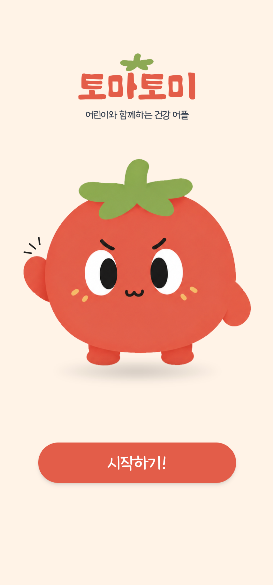 | 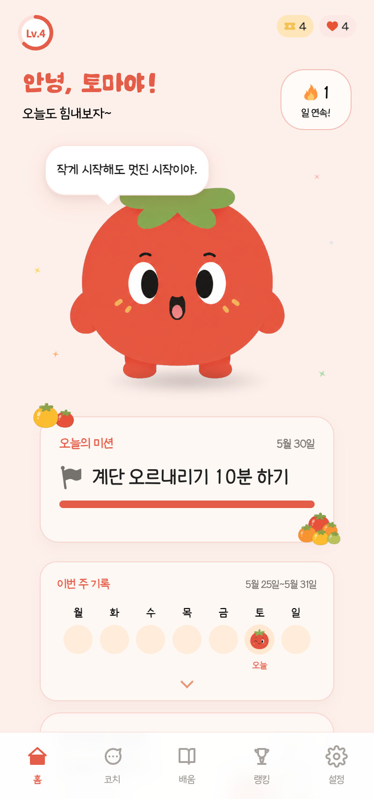 | 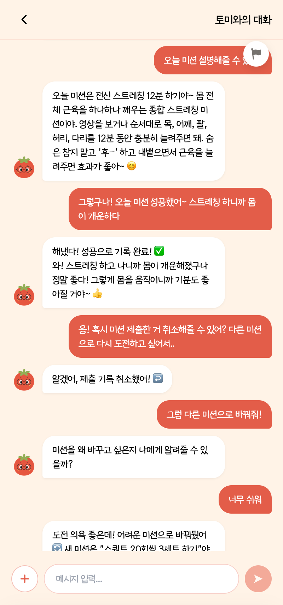 |

### 교육 콘텐츠

RAG 기반 건강 교육 콘텐츠와 퀴즈를 제공해 어린이가 건강 정보를 쉽게 학습할 수 있습니다.

| 교육 화면 | 퀴즈 화면 |
| --- | --- |
| 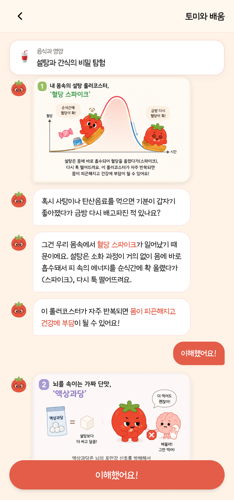 | 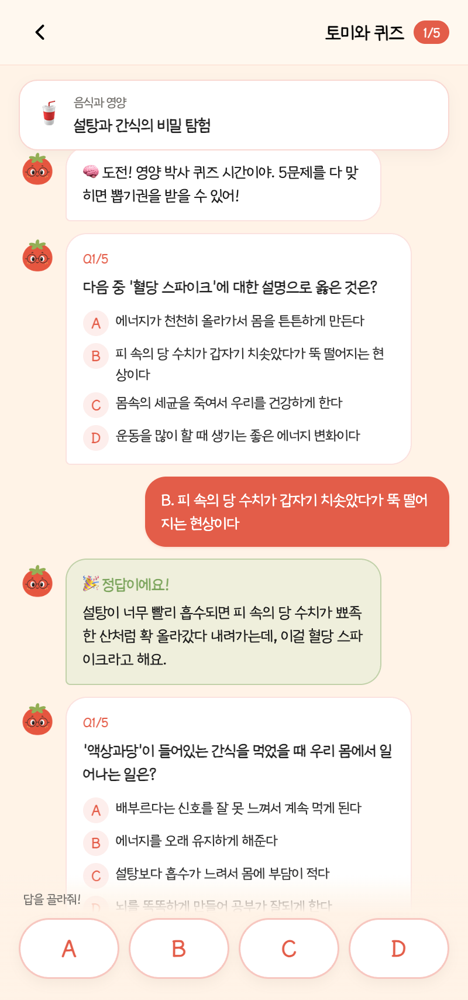 |

### 부가 기능

랭킹, 주간 공유, 보상 시스템과 게임을 통해 지속적인 참여를 유도합니다.

| 랭킹 | 설정 | 주간 공유 | 게임 |
| --- | --- | --- | --- |
| 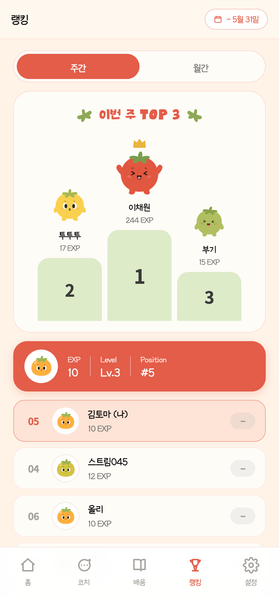 | 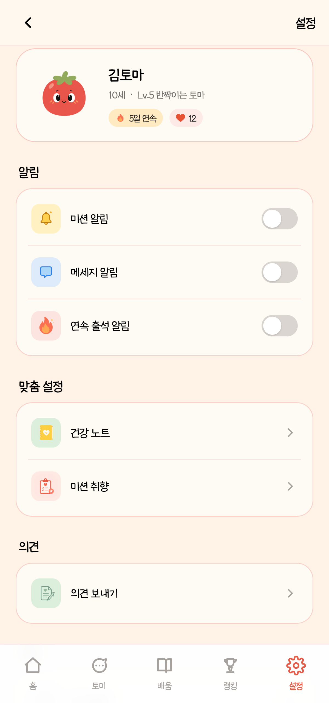 | 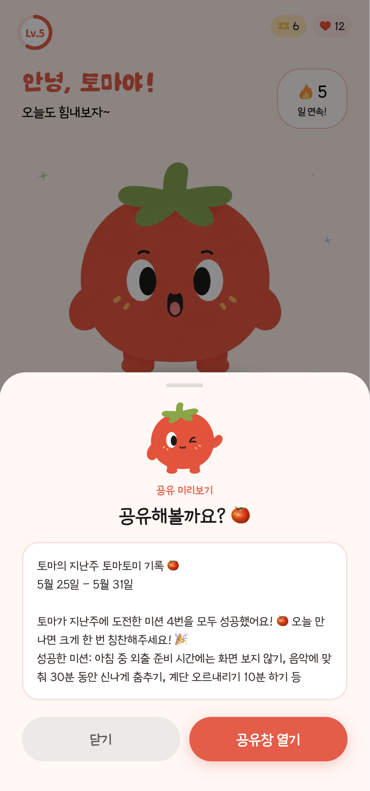 | 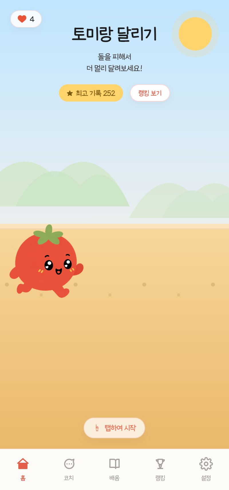 |

건강 노트와 설정 화면에서 사용자 건강 상태, 생활 습관 정보, 맞춤 미션 관리 기능을 지원합니다.

## 9. 실행 방법

### Backend 실행

```bash
cd backend
pip install -r requirements.txt
uvicorn main:app --reload
```

### Frontend 실행

```bash
cd frontend
npm install
npm run dev
```

### Ollama 실행

```bash
ollama serve
ollama pull gemma4:e2b
ollama pull qwen3-function:latest
```

### DB 마이그레이션

```bash
psql "$DATABASE_URL" -f backend/migrations/003_runtime_schema.sql
psql "$DATABASE_URL" -f backend/migrations/004_remove_stair_floor_threshold.sql
```

### 주요 환경 변수

```env
DATABASE_URL=
OLLAMA_BASE_URL=http://localhost:11434
OLLAMA_MODEL=gemma4:e2b
ROUTER_MODEL=gemma4:e2b
FUNCTION_MODEL=qwen3-function:latest
EMBEDDING_MODEL=BAAI/bge-m3
EMBEDDING_DIM=1024
OLLAMA_AUTOSTART=true
OLLAMA_STARTUP_TIMEOUT=15
CHAT_SAVE_POOL_MINCONN=1
CHAT_SAVE_POOL_MAXCONN=5
DEMO_MODE=false
GOOGLE_SPREADSHEET_ID=
GOOGLE_STUDENT_INFO_SHEET_TITLE=학생 등록 정보
```

## 10. 프로젝트 구조

```text
capstone26/
├── backend/
│   ├── main.py                         # FastAPI 엔드포인트
│   ├── chat_service.py                 # 채팅 처리 및 스트리밍 응답
│   ├── intent_router.py                # Intent Routing
│   ├── qwen_client.py                  # Function Calling
│   ├── rag.py                          # RAG 검색
│   ├── mission_generator.py            # 미션 생성
│   ├── mission_personalization.py      # 개인화 로직
│   ├── submit_validator.py             # 미션 제출 검증
│   ├── database.py                     # DB 연결 및 CRUD
│   ├── migrations/                     # DB 마이그레이션 SQL
│   ├── scripts/                        # 평가, RAG 적재, 데이터 처리 스크립트
│   └── data/
│       ├── eval/                       # RAG 평가 데이터
│       └── regression/                 # 회귀 테스트 데이터
└── frontend/
    ├── src/
    │   ├── App.jsx
    │   ├── api.js
    │   ├── components/                 # 화면 컴포넌트
    │   └── assets/                     # 토마토미 캐릭터 및 UI 에셋
    ├── package.json
    ├── vite.config.js
    └── tailwind.config.js
```

## 11. 트러블슈팅

### 경량 로컬 LLM의 낮은 기본 성능

0.6B, 2B급 경량 모델은 일반적인 대화는 가능하지만 미션 제출, 변경, 취소, 조회처럼 실제 DB 상태가 바뀌는 기능에서는 오분류 위험이 컸습니다. 이를 해결하기 위해 Intent Router, Function Calling, validator, DB 반영 검증 로직을 분리했습니다.

### 모호한 자연어 입력 처리

"10분 했어"처럼 어떤 미션을 수행했는지 불분명한 발화는 바로 성공으로 기록하지 않고 확인 질문을 생성하도록 설계했습니다. 이를 통해 DB 오기록 방지율을 높였습니다.

### RAG 검색 실패와 근거 없는 답변

일부 건강 질문에서 관련 문서가 검색되지 않았음에도 LLM이 사전 지식으로 답변하는 문제가 확인되었습니다. 검색 실패 케이스를 분석해 건강 문서를 보강하고, 답변 근거성을 평가 항목으로 분리했습니다.

### 응답 지연

로컬 CPU 환경에서는 전체 응답 시간이 크게 증가했습니다. 스트리밍 응답, 모델 경량화, 원격 GPU 환경 비교를 통해 최종 GPU 환경에서 평균 응답 시간을 12~14초 수준으로 단축했습니다.

## 12. 향후 개선 사항

- 실제 사용자 발화 로그 기반 테스트셋 확장
- Function Calling 인자 추출 정확도 개선
- DB 변경 필요 케이스의 반영 성공률 개선
- RAG 문서 보강 및 검색 실패 시 답변 제한 로직 강화
- 모델 경량화 및 양자화를 통한 온디바이스 실행 가능성 검토
- 보호자·교사용 리포트 및 활동 공유 기능 고도화

## 13. 참고 자료

### 건강 정보 출처

- [질병관리청 국가건강정보포털 - 청소년 건강정보](https://health.kdca.go.kr/healthinfo/biz/health/gnrlzHealthInfo/gnrlzHealthInfo/gnrlzHealthInfoYouth.do)

### 관련 레포지토리

| 프로젝트 | 설명 |
| --- | --- |
|  [Function Calling Data Augmentation Pipeline](https://github.com/jaenga/function-calling-data-augmentation) | Qwen3 0.6B Function Calling Fine-tuning을 위한 데이터 증강·검증 파이프라인 |

### 사용 모델

- [Google Gemma](https://ai.google.dev/gemma)
- [Qwen](https://qwen.ai/research)

### 사용 기술

- [FastAPI Documentation](https://fastapi.tiangolo.com/)
- [React Documentation](https://react.dev/)
- [Vite Documentation](https://vite.dev/)
- [Ollama Documentation](https://ollama.com/)
- PostgreSQL
- pgvector
